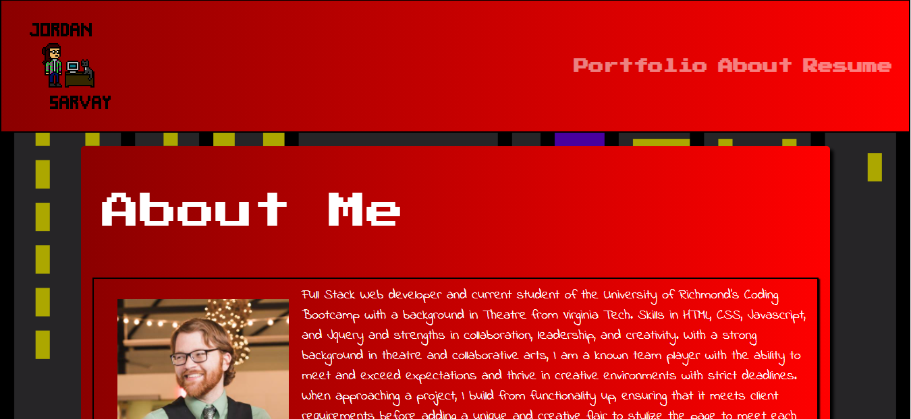
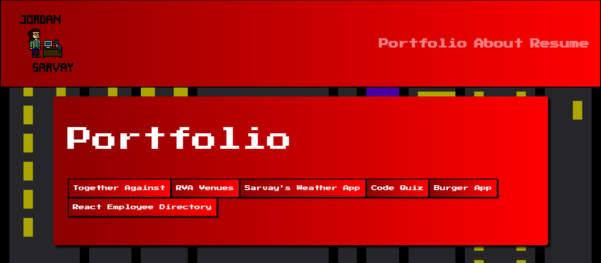
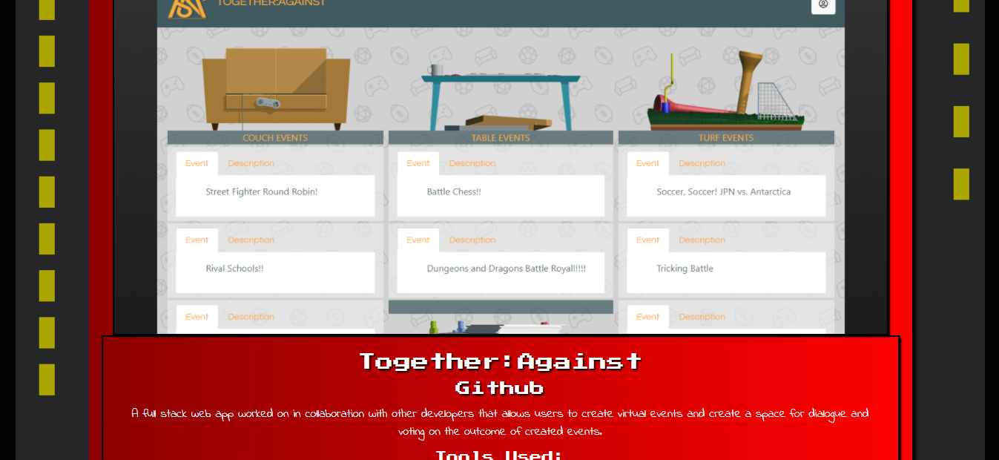

# React Employee Directory
### Created by Jordan Sarvay

## Description
Utilizes an API call to randomuser.me in order to generate a database of employees with the functionality to search through and sort, all in React!

[Deployed Link](https://jsarvay.herokuapp.com/)

## Table of Contents
* [Installation](#installation)
* [Usage](#usage)
* [Contributing](#contributing)
* [Testing](#testing)
* [Questions](#questions)
    
## Installation

This app is hosted on Heroku and requires no installation on the user end.
    
## Usage

Simply visit the deployed page and you will be able to view my portfolio page. This includes an about me section, resume, portfolio, and contact information.
    
## Contributing

As this is a personal portfolio, there is no need for additional contributions.

## Testing

No test files were created for this app, though in future deployment they will be created and run through JEST.
    
## Questions

Please feel free to reach out to either of the following links with questions regarding the use of this application.

##### Github: [JSarvay](http://github.com/JSarvay/)
##### E-mail: jordans1@vt.edu

Standard Landing page for the app.

Shows the top of the portfolio page.

Shows a project jumbotron.